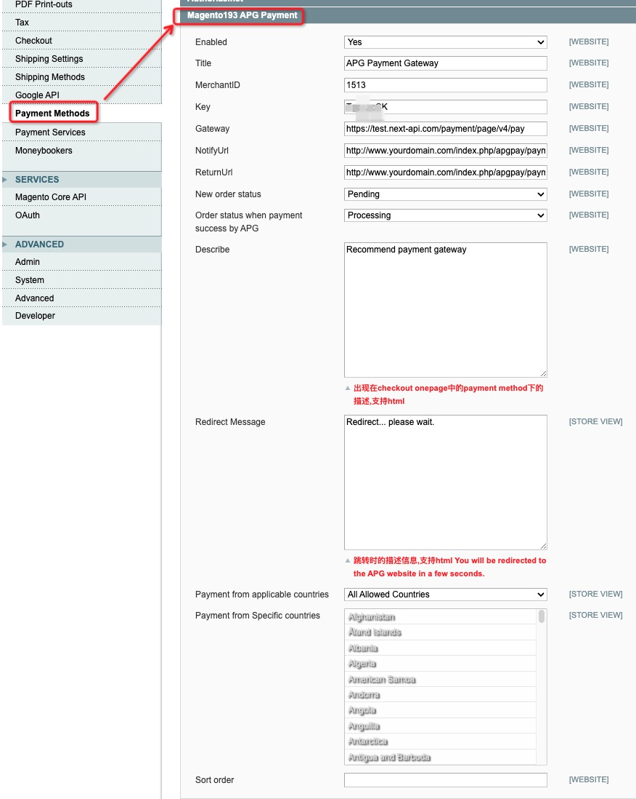

# 一、安装步骤
- 下载插件代码，若您不会使用Github，可以点击Code -> Download Zip下载代码压缩包
- 将app、skin两个目录上传到magento发布目录下。
- 注意，如果网站开启编译、需要关闭编译状态，然后再上传插件文件。
- 编译状态是否开启，请检查 system->tools->Compilation； Compiler status应该是Disabled。

# 二、后台配置
后台系统 -> 配置 -> payment methods:

找到 Magento193 APG Payment，配置如下参数


- Enabled
  
  是否启用，选择启用

- Title		
  
  标题，输入支付方式标题，例如：APG Credit payment
  
- MerchantID	 
  
  商户id，从APG获取
  
- Key	
  
  密钥,从APG 处获取

- Gateway
  
  网关提交接口,填写 `https://test.next-api.com/payment/page/v4/pay` 生产环境联系技术支持

- ReturnUrl
  
  回调地址填写 `http://www.yourdomain.com/index.php/apgpay/payment/return`

- NotifyUrl
  
  异步通知地址 `http://www.yourdomain.com/index.php/apgpay/payment/notify`

- New order status	
  
  新订单状态 选择 pending

- Order status when payment success by APG
  
  订单支付成功状态 选择 processing

- Describe
  
  描述出现在checkout onepage中的payment method下的描述,支持html

- Redirect Message 
  
  支付跳转时的描述信息,支持html. 例如：You will be redirected to the APG website in a few seconds.

- Sort order

  支付方式排序，按需设置，可以留空。

# 配置demo

如下图




# 推荐的测试方法

使用docker来测试，可以有效屏蔽环境配置问题，减少重复安装和配置的工作量。

- mysql docker image 5.7.5

magento版本比较老，推荐使用[mysql5.7](https://hub.docker.com/_/mysql/tags?page=1&name=5.7); arm架构的可以参考[here](https://betterprogramming.pub/mysql-5-7-does-not-have-an-official-docker-image-on-arm-m1-mac-e55cbe093d4c)

启动完成后创建数据库备用，注意修改密码
```shell
docker run --rm  -e MYSQL_ROOT_PASSWORD=password  -p 3306:3306   mysql:5.7.5
```


- magento docker  image 1.9.3

[https://hub.docker.com/r/alexcheng/magento](https://hub.docker.com/r/alexcheng/magento)

后台启动 `docker run -d -p 80:80 alexcheng/magento` 

启动后可以直接进入安装流程，mysql连接上一步创建好的数据库。

# 常见问题

安装过程常见问题如下

- 插件的文件和文件夹权限问题，请确认文件和文件夹与magento系统其他文件的选项相同
- 插件的文件和文件夹用户与用户组问题，请确认文件夹与文件与magento系统其他文件属于同一个用户和用户组
- 缓存问题；完成插件文件上传和权限/用户确认之后，在后台system->cache management中刷新缓存
